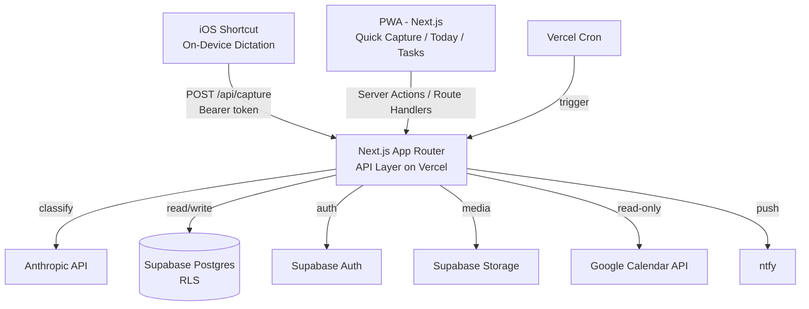

# PRD — Atlas

> Arbeitstitel „Atlas". Prosa auf Deutsch, alle technischen Identifier (Tabellen, Felder, Endpoints, Packages) auf Englisch.

## 1. Overview

### Product Summary
Atlas ist ein persönliches Lebens-OS, das per Sprach- oder Text-Capture alles über alle Lebensbereiche hinweg erfasst, von KI automatisch einsortiert und nichts mehr verloren gehen lässt. Im Kern steht eine Capture-Pipeline: Rohtext (gesprochen oder getippt) wird per Anthropic-API in strukturierte Einträge — Task, Notiz, Journal, Routine — klassifiziert und in den richtigen Lebensbereich gelegt. Drumherum liegen ein Today-View, Tasks, Routinen mit Streaks und ein leichtgewichtiges Journal.

### Objective
Dieses PRD deckt den MVP ab, wie in `docs/product-vision.md` § Product Strategy > MVP Definition definiert: Capture-Pipeline, Today-View, Tasks-CRUD, Areas, Routines + Streaks, Journal und Auth. AI-Chat, Slipping-Erkennung und der geteilte Haushalts-Bereich sind explizit Out of Scope für v1 (siehe § 13).

### Market Differentiation
Technisch muss die Implementierung zwei Dinge liefern, an denen sich die Differenzierung entscheidet: kompromisslos niedrige Capture-Latenz (gesprochener Satz → gespeichert in < 5 s) und zuverlässige KI-Klassifikation (Korrekturrate < 20 %). Alles andere ist CRUD. Diese beiden Punkte sind die technischen Erfolgshebel.

### Magic Moment
Ein gesprochener Satz ins iPhone, fünf Sekunden später korrekt einsortiert. Technisch muss dafür perfekt funktionieren: der iOS-Shortcut (On-Device-Diktat → authentifizierter POST), der `/api/capture`-Endpoint (Anthropic-Klassifikation + Insert), und die Rückmeldung. Schnell sein muss der Klassifikations-Call; nahtlos sein muss die Authentifizierung; perfekt funktionieren muss das Mapping von Rohtext auf `{type, title, due_at, area_id}`.

### Success Criteria
- Time-to-Magic-Moment: gesprochener Satz → gespeicherter, korrekt einsortierter Eintrag in < 5 s (p95).
- KI-Korrekturrate < 20 % über die ersten 100 Captures.
- Today-View lädt in < 2 s (LCP) auf Mobile.
- Alle P0-Features funktional, Capture-Pfad mit Tests abgedeckt.
- PWA installierbar, offline-tolerant für Lesezugriff auf bereits geladene Daten.

## 2. Technical Architecture

### Architecture Overview


### Chosen Stack
| Layer | Choice | Rationale |
|---|---|---|
| Frontend | Next.js (App Router) + TypeScript, als PWA | Etablierter Stack des Nutzers, beste KI-Coding-Tool-Unterstützung, deployt nahtlos auf Vercel, PWA-fähig für Homescreen-Zugriff. |
| Backend | Supabase + Next.js Route Handlers/Server Actions | Managed Postgres/Auth/Storage aus einer Hand; leichte Background-Jobs via Vercel Cron; Self-Hosting-Exit ohne Code-Änderung. |
| Database | Supabase Postgres (RLS, pgvector in Phase 2) | Relationales Modell passt zu Tasks/Areas/Routines/Journal; RLS sauber per `user_id`; pgvector für späteren KI-Chat. |
| Auth | Supabase Auth | Im Backend enthalten, kein Zusatzanbieter; schützt PWA und Capture-Endpoint per Token. |
| Payments | None | Persönliches Single-User-Tool ohne Monetarisierung. |

### Stack Integration Guide
**Setup-Reihenfolge:** (1) Supabase-Projekt anlegen, Postgres-Schema + RLS-Policies migrieren. (2) Next.js-App scaffolden mit `@supabase/ssr` für Server-Side-Auth. (3) Supabase Auth konfigurieren (E-Mail/Passwort genügt für Single-User; optional Magic Link). (4) Anthropic-SDK + `ANTHROPIC_API_KEY` einbinden, Capture-Endpoint bauen. (5) ntfy-Topic + Google-Calendar-OAuth zuletzt.

**Bekannte Patterns / Gotchas:**
- Supabase-Auth mit Next.js App Router immer über `@supabase/ssr` (nicht das alte `auth-helpers`), Server- und Client-Clients getrennt instanziieren. Cookies in `middleware.ts` refreshen.
- RLS ist auch im Single-User-Fall aktiv: jede Tabelle bekommt `user_id uuid references auth.users` und eine Policy `auth.uid() = user_id`. Der Capture-Endpoint nutzt den Service-Role-Key NICHT für User-Daten, sondern den authentifizierten User-Context.
- Der iOS-Shortcut authentifiziert per langlebigem Bearer-Token (eigene `api_tokens`-Tabelle), nicht per Supabase-Session — Shortcuts halten keine Cookies.
- Anthropic-Call mit `response_format`-Disziplin: System-Prompt fordert striktes JSON, Antwort defensiv parsen (Markdown-Fences strippen) und gegen ein zod-Schema validieren.
- Vercel Cron triggert nur kurze Route Handler; keine langlaufenden Prozesse. Für DB-nahe Jobs alternativ Supabase `pg_cron` + Edge Functions.

**Required Environment Variables:**
```
NEXT_PUBLIC_SUPABASE_URL=
NEXT_PUBLIC_SUPABASE_ANON_KEY=
SUPABASE_SERVICE_ROLE_KEY=        # nur serverseitig, nie im Client
ANTHROPIC_API_KEY=
NTFY_TOPIC_URL=                   # z.B. https://ntfy.sh/atlas-dom-<random>
GOOGLE_CALENDAR_CLIENT_ID=
GOOGLE_CALENDAR_CLIENT_SECRET=
GOOGLE_CALENDAR_REFRESH_TOKEN=
CAPTURE_PEPPER=                   # zum Hashen der API-Tokens
```

### Repository Structure
```
atlas/
├── src/
│   ├── app/
│   │   ├── (app)/                # Authentifizierte Routes
│   │   │   ├── today/page.tsx
│   │   │   ├── tasks/page.tsx
│   │   │   ├── areas/page.tsx
│   │   │   ├── routines/page.tsx
│   │   │   ├── journal/page.tsx
│   │   │   └── settings/page.tsx
│   │   ├── (auth)/login/page.tsx
│   │   ├── api/
│   │   │   ├── capture/route.ts          # Core: Klassifikation + Insert
│   │   │   ├── cron/
│   │   │   │   ├── daily-summary/route.ts
│   │   │   │   └── calendar-sync/route.ts
│   │   │   └── webhooks/
│   │   ├── manifest.ts                   # PWA Manifest
│   │   └── layout.tsx
│   ├── components/
│   │   ├── ui/                           # Design-System-Primitives (siehe docs/design.md)
│   │   └── features/
│   │       ├── capture/QuickCapture.tsx
│   │       ├── today/TodayView.tsx
│   │       ├── tasks/TaskList.tsx
│   │       ├── routines/RoutineList.tsx
│   │       └── journal/JournalFeed.tsx
│   ├── lib/
│   │   ├── supabase/{server,client,middleware}.ts
│   │   ├── ai/classify.ts                # Anthropic-Klassifikation
│   │   ├── calendar/google.ts
│   │   ├── notify/ntfy.ts
│   │   └── schemas/                      # zod-Schemas
│   └── middleware.ts
├── supabase/
│   ├── migrations/                       # SQL-Migrations
│   └── config.toml
├── public/                               # PWA-Icons, statische Assets
├── ios-shortcut/README.md                # Anleitung zum Shortcut-Setup
└── vercel.json                           # Cron-Definitionen
```

### Infrastructure & Deployment
Frontend + API auf **Vercel** (Git-Push-Deploy, Preview-Deployments pro PR). **Supabase Cloud** für Postgres/Auth/Storage. Background-Jobs via **Vercel Cron** (`vercel.json`), definiert für `daily-summary` (z.B. 06:00) und `calendar-sync` (alle 30 min). Secrets als Vercel Environment Variables. Kein eigenes CI nötig über Vercels Build hinaus; optional GitHub Actions für Lint/Test vor Merge. Self-Hosting-Exit: Supabase self-hosten + App als Container auf Coolify/Dokploy, nur Connection-Strings ändern.

### Security Considerations
- **Auth-Flow:** Supabase Auth (E-Mail/Passwort oder Magic Link). Session-Cookies via `@supabase/ssr`, Refresh in `middleware.ts`.
- **Capture-Endpoint:** Bearer-Token aus `api_tokens` (gehasht gespeichert mit `CAPTURE_PEPPER`), Token-Lookup mappt auf `user_id`. Rate-Limiting auf `/api/capture` (z.B. 60/min) gegen Missbrauch.
- **RLS:** Auf allen User-Tabellen aktiv, Policy `auth.uid() = user_id`. Service-Role-Key ausschließlich serverseitig und nur für System-Operationen.
- **Input Validation:** Jeder API-Input gegen zod-Schema. Anthropic-Output defensiv parsen und validieren, nie ungeprüft in DB schreiben.
- **Storage:** Journal-Fotos in privatem Supabase-Storage-Bucket mit signed URLs, RLS-geschützt.
- **OWASP:** Standard-Headers via Next.js, kein Roh-SQL ohne Parametrisierung, Secrets nie im Client-Bundle.

### Cost Estimate
Bei Single-User-Last praktisch im Free Tier:
- **Vercel** Hobby: 0 €. (Free-Tier-Limits für Bandbreite/Cron ausreichend; Cron auf Hobby begrenzt, für 2 Jobs ok.)
- **Supabase** Free: 0 € (500 MB DB, 1 GB Storage, genug für eine Person). Pro bei Bedarf ~25 €/Monat.
- **Anthropic API:** abhängig vom Modell und Capture-Volumen; bei ~10 Captures/Tag mit einem schnellen Modell grob 1–5 €/Monat.
- **ntfy:** 0 € (ntfy.sh) oder self-hosted.
- **Google Calendar API:** 0 €.
- **Summe:** ~1–5 €/Monat im Start, < 30 €/Monat auch bei großzügigem Wachstum.

## 3. Data Model

### Entity Definitions
```sql
-- Lebensbereiche, oberste Organisationsebene
CREATE TABLE areas (
  id UUID PRIMARY KEY DEFAULT gen_random_uuid(),
  user_id UUID NOT NULL REFERENCES auth.users(id) ON DELETE CASCADE,
  name VARCHAR(120) NOT NULL,
  slug VARCHAR(120) NOT NULL,
  color VARCHAR(20),                       -- Token-Name aus docs/design.md
  icon VARCHAR(40),
  sort_order INT NOT NULL DEFAULT 0,
  last_activity_at TIMESTAMPTZ,            -- für spätere Slipping-Erkennung
  created_at TIMESTAMPTZ NOT NULL DEFAULT NOW(),
  UNIQUE (user_id, slug)
);

-- Roh-Captures vor/parallel zur Klassifikation (Audit + Reklassifikation)
CREATE TABLE inbox_items (
  id UUID PRIMARY KEY DEFAULT gen_random_uuid(),
  user_id UUID NOT NULL REFERENCES auth.users(id) ON DELETE CASCADE,
  raw_text TEXT NOT NULL,                  -- bereinigter Diktat-/Texteingabe-Text
  source VARCHAR(20) NOT NULL,             -- 'ios_shortcut' | 'pwa_voice' | 'pwa_text'
  classified_type VARCHAR(20),            -- 'task' | 'note' | 'journal' | 'routine' | null
  classified_into UUID,                    -- id des erzeugten Eintrags
  status VARCHAR(20) NOT NULL DEFAULT 'pending', -- 'pending'|'classified'|'failed'
  ai_meta JSONB,                           -- Modellantwort, Konfidenz, Latenz
  created_at TIMESTAMPTZ NOT NULL DEFAULT NOW()
);

CREATE TABLE tasks (
  id UUID PRIMARY KEY DEFAULT gen_random_uuid(),
  user_id UUID NOT NULL REFERENCES auth.users(id) ON DELETE CASCADE,
  area_id UUID REFERENCES areas(id) ON DELETE SET NULL,
  title TEXT NOT NULL,
  notes TEXT,
  due_at TIMESTAMPTZ,
  reminder_at TIMESTAMPTZ,
  is_top3 BOOLEAN NOT NULL DEFAULT FALSE,
  status VARCHAR(20) NOT NULL DEFAULT 'open', -- 'open' | 'done'
  completed_at TIMESTAMPTZ,
  recurrence VARCHAR(40),                  -- z.B. 'daily','weekly','monthly', null
  source_inbox_id UUID REFERENCES inbox_items(id) ON DELETE SET NULL,
  created_at TIMESTAMPTZ NOT NULL DEFAULT NOW(),
  updated_at TIMESTAMPTZ NOT NULL DEFAULT NOW()
);

CREATE TABLE routines (
  id UUID PRIMARY KEY DEFAULT gen_random_uuid(),
  user_id UUID NOT NULL REFERENCES auth.users(id) ON DELETE CASCADE,
  area_id UUID REFERENCES areas(id) ON DELETE SET NULL,
  name VARCHAR(160) NOT NULL,
  description TEXT,
  time_of_day VARCHAR(20) NOT NULL DEFAULT 'anytime', -- 'morning'|'afternoon'|'evening'|'anytime'
  specific_time TIME,
  notify BOOLEAN NOT NULL DEFAULT FALSE,
  duration_days INT,                       -- null = ongoing, sonst befristeter Streak
  start_date DATE NOT NULL DEFAULT CURRENT_DATE,
  archived_at TIMESTAMPTZ,
  created_at TIMESTAMPTZ NOT NULL DEFAULT NOW()
);

CREATE TABLE routine_logs (
  id UUID PRIMARY KEY DEFAULT gen_random_uuid(),
  user_id UUID NOT NULL REFERENCES auth.users(id) ON DELETE CASCADE,
  routine_id UUID NOT NULL REFERENCES routines(id) ON DELETE CASCADE,
  log_date DATE NOT NULL,
  completed BOOLEAN NOT NULL DEFAULT TRUE,
  created_at TIMESTAMPTZ NOT NULL DEFAULT NOW(),
  UNIQUE (routine_id, log_date)
);

CREATE TABLE journal_entries (
  id UUID PRIMARY KEY DEFAULT gen_random_uuid(),
  user_id UUID NOT NULL REFERENCES auth.users(id) ON DELETE CASCADE,
  area_id UUID REFERENCES areas(id) ON DELETE SET NULL,
  body TEXT NOT NULL,
  entry_date DATE NOT NULL DEFAULT CURRENT_DATE,
  source VARCHAR(20) NOT NULL DEFAULT 'pwa_text',
  source_inbox_id UUID REFERENCES inbox_items(id) ON DELETE SET NULL,
  created_at TIMESTAMPTZ NOT NULL DEFAULT NOW()
);

CREATE TABLE journal_media (
  id UUID PRIMARY KEY DEFAULT gen_random_uuid(),
  user_id UUID NOT NULL REFERENCES auth.users(id) ON DELETE CASCADE,
  journal_entry_id UUID NOT NULL REFERENCES journal_entries(id) ON DELETE CASCADE,
  storage_path TEXT NOT NULL,              -- Pfad im privaten Storage-Bucket
  media_type VARCHAR(20) NOT NULL DEFAULT 'image',
  created_at TIMESTAMPTZ NOT NULL DEFAULT NOW()
);

-- Langlebige Tokens für den iOS-Shortcut (gehasht)
CREATE TABLE api_tokens (
  id UUID PRIMARY KEY DEFAULT gen_random_uuid(),
  user_id UUID NOT NULL REFERENCES auth.users(id) ON DELETE CASCADE,
  token_hash TEXT NOT NULL,
  label VARCHAR(80),
  last_used_at TIMESTAMPTZ,
  created_at TIMESTAMPTZ NOT NULL DEFAULT NOW()
);
```
Auf allen Tabellen: `ALTER TABLE ... ENABLE ROW LEVEL SECURITY;` plus Policy `USING (auth.uid() = user_id)` für select/insert/update/delete.

### Relationships
- `areas` 1:many `tasks`, `routines`, `journal_entries` (FK `area_id`, `ON DELETE SET NULL` — Einträge überleben das Löschen einer Area, werden heimatlos und müssen reattacht werden).
- `routines` 1:many `routine_logs` (`ON DELETE CASCADE`).
- `journal_entries` 1:many `journal_media` (`ON DELETE CASCADE`).
- `inbox_items` 1:1 (optional) zum erzeugten Eintrag via `classified_into` / `source_inbox_id` (lose gekoppelt für Reklassifikation).
- `auth.users` 1:many alle User-Tabellen (`ON DELETE CASCADE`).

### Indexes
- `tasks (user_id, status, due_at)` — Today-View und Tasks-Liste nach Fälligkeit.
- `tasks (user_id, is_top3) WHERE is_top3` — schneller Top-3-Zugriff.
- `routine_logs (routine_id, log_date)` — Streak-Berechnung.
- `journal_entries (user_id, entry_date DESC)` — Journal-Feed.
- `inbox_items (user_id, status, created_at DESC)` — „kürzlich erfasst" und Fehler-Recovery.
- `areas (user_id, sort_order)` — geordnete Bereichsliste.
- `api_tokens (token_hash)` — Token-Lookup beim Capture.

## 4. API Specification

### API Design Philosophy
REST über Next.js Route Handlers für externe Clients (iOS-Shortcut → `/api/capture`), Server Actions für interne PWA-Mutationen. Auth intern via Supabase-Session, extern via Bearer-Token. Fehlerformat einheitlich: `{ error: string, details?: unknown }`. Listen sind für einen Einzelnutzer klein — keine Pagination im MVP, nur sinnvolle Default-Limits.

```
POST /api/capture
Auth: Bearer token (api_tokens) ODER Supabase-Session
Body: { text: string, source: 'ios_shortcut'|'pwa_voice'|'pwa_text' }
Verhalten: 1) inbox_item (status=pending) anlegen 2) Anthropic-Klassifikation
           3) Zieleintrag (task|note|journal|routine) anlegen, mit area_id
           4) inbox_item auf classified setzen
Response 201: { type, id, title, area: { id, name }, due_at: string|null }
Response 207: { type:'note', id, note:'unklassifiziert, in Inbox' }  # Fallback
Response 400: { error:'invalid input', details }
Response 401: { error:'Unauthorized' }
Response 429: { error:'rate limited' }
```
Interne Operationen (Server Actions, Auth via Session):
```
tasks:    list(filter) · create · update · toggleComplete · setTop3 · remove
areas:    list · create · update · reorder · remove
routines: list · create · update · archive · logToday(routineId) · streak(routineId)
journal:  listFeed · create(body, areaId, mediaFiles[]) · remove
today:    summary()  -> { top3, dueToday, recentInbox, calendarEvents }
tokens:   list · create -> { plaintextOnce } · revoke
```
Cron-Endpoints:
```
GET /api/cron/daily-summary   # Auth via Vercel Cron secret -> ntfy-Push
GET /api/cron/calendar-sync   # Google Calendar read-only -> Cache/Tabelle
```

## 5. User Stories

### Epic: Capture
**US-001: Voice-Capture unterwegs**
Als Dominic will ich unterwegs einen Satz ins iPhone diktieren, damit ein Gedanke ohne Anhalten erfasst und einsortiert wird.
Acceptance Criteria:
- [ ] Given der Shortcut ist eingerichtet, when ich diktiere und sende, then erscheint der Eintrag korrekt einsortiert in Atlas.
- [ ] Given der Anthropic-Call liefert eine Fälligkeit, when der Task erzeugt wird, then ist `due_at` gesetzt.
- [ ] Edge case: Klassifikation schlägt fehl → Eintrag landet als Notiz in der Inbox, kein Datenverlust.

**US-002: Text-Quick-Capture am Desktop**
Als Dominic will ich per `Cmd+J` ein Eingabefeld öffnen und tippen, damit ich am Schreibtisch ohne Kontextwechsel erfasse.
Acceptance Criteria:
- [ ] Given die PWA ist offen, when ich `Cmd+J` drücke, then öffnet sich das Capture-Feld fokussiert.
- [ ] Given ich sende Text, then erscheint eine knappe Bestätigung mit Typ und Area.

### Epic: Today & Tasks
**US-003: Tagesüberblick**
Als Dominic will ich morgens Top-3, Fälligkeiten und Kalender auf einen Blick sehen, damit ich den Tag ohne Listen-Chaos plane.
Acceptance Criteria:
- [ ] Given ich öffne Today, then sehe ich Top-3, heute fällige Tasks und Google-Kalender-Termine.
- [ ] Given ich markiere einen Task als Top-3, then erscheint er im Top-3-Bereich.

**US-004: Task abhaken**
Als Dominic will ich Tasks abhaken und Fälligkeiten/Areas ändern, damit der Aufgaben-Lebenszyklus vollständig ist.
Acceptance Criteria:
- [ ] Given ein offener Task, when ich abhake, then `status='done'` und er verschwindet aus offenen Listen.
- [ ] Edge case: wiederkehrender Task → beim Abhaken wird die nächste Instanz erzeugt.

### Epic: Areas
**US-005: Lebensbereiche verwalten**
Als Dominic will ich Areas anlegen und ordnen, damit jeder Eintrag eine Heimat hat.

### Epic: Routines
**US-006: Routine mit Streak**
Als Dominic will ich eine Hyrox-Routine anlegen und täglich abhaken, damit ich meinen Streak sehe.
Acceptance Criteria:
- [ ] Given eine Routine, when ich heute abhake, then erhöht sich der Streak und der heutige Tag ist markiert.
- [ ] Given eine befristete Routine (`duration_days`), when der Zeitraum endet, then wird sie archiviert und im Verlauf angezeigt.

### Epic: Journal
**US-007: Journal-Eintrag per Voice mit Foto**
Als Dominic will ich einen Spracheintrag machen und ein Foto anhängen, damit Reflexion beiläufig festgehalten wird.

### Epic: Auth & Settings
**US-008: Shortcut-Token erzeugen**
Als Dominic will ich in den Settings ein API-Token erzeugen, damit der iOS-Shortcut authentifiziert sendet.
Acceptance Criteria:
- [ ] Given ich erzeuge ein Token, then wird es genau einmal im Klartext angezeigt und danach nur gehasht gespeichert.

## 6. Functional Requirements

**FR-001: Capture-Endpoint mit KI-Klassifikation**
Priority: P0
Description: `/api/capture` nimmt Rohtext + Source, legt ein `inbox_item` an, ruft die Anthropic-Klassifikation auf und erzeugt den Zieleintrag mit `area_id` und ggf. `due_at`.
Acceptance Criteria:
- Klassifikation liefert validiertes JSON `{type, title, due_at?, area_slug?}`.
- Bei Parse-/Validierungsfehler Fallback auf Notiz in der Inbox, Response 207.
- p95-Latenz < 5 s.
Related Stories: US-001, US-002

**FR-002: KI-Klassifikationslogik**
Priority: P0
Description: `lib/ai/classify.ts` mappt Rohtext auf Typ, Titel, Fälligkeit und passende Area (aus den existierenden Areas des Users). System-Prompt mit Few-Shot-Beispielen; Ausgabe striktes JSON.
Acceptance Criteria:
- Vorhandene Areas werden als Kontext mitgegeben; Klassifikation wählt eine existierende oder schlägt „unzugeordnet" vor.
- Relative Zeitangaben („morgen 17 Uhr") werden in absolute `due_at` in der User-Zeitzone aufgelöst.

**FR-003: Today-View**
Priority: P0
Description: Aggregiert Top-3, heute fällige Tasks, „kürzlich erfasst" und Google-Kalender-Termine.
Related Stories: US-003

**FR-004: Tasks-CRUD inkl. Top-3, Recurrence, Reminder**
Priority: P0
Related Stories: US-004

**FR-005: Areas-CRUD inkl. Sortierung**
Priority: P0
Related Stories: US-005

**FR-006: Auth + Shortcut-Tokens**
Priority: P0
Description: Supabase Auth für die PWA; `api_tokens` für den Shortcut (gehasht, einmalige Klartextanzeige).
Related Stories: US-008

**FR-007: Routines + Streak-Berechnung**
Priority: P1
Description: Routinen anlegen, täglich abhaken (`routine_logs`), Streak aus aufeinanderfolgenden `log_date` berechnen, befristete Routinen archivieren.
Related Stories: US-006

**FR-008: Journal mit Foto-Upload**
Priority: P1
Description: Journal-Einträge per Text/Voice, Foto-Upload in privaten Storage-Bucket mit signed URLs.
Related Stories: US-007

**FR-009: Reminder-Push via ntfy**
Priority: P1
Description: Tasks mit `reminder_at` lösen einen ntfy-Push aus; Daily-Summary-Cron sendet morgens eine Übersicht.

**FR-010: Google Calendar read-only**
Priority: P1
Description: Cron synct Kalendertermine read-only in einen Cache zur Anzeige im Today-View.

**FR-011: PWA-Installierbarkeit**
Priority: P1
Description: Manifest + Service Worker; installierbar auf iPhone-Homescreen; Lesezugriff auf bereits geladene Daten offline-tolerant.

**FR-012: Reklassifikation / Korrektur**
Priority: P2
Description: Einen falsch einsortierten Eintrag in einen anderen Typ/Area verschieben; Korrektur wird (für spätere Prompt-Verbesserung) protokolliert.

## 7. Non-Functional Requirements

### Performance
- Capture-Pfad p95 < 5 s (Diktat → gespeichert), Klassifikations-Call p95 < 3 s.
- Today-View LCP < 2 s auf Mobile, TTI < 3 s.
- Initiales JS-Bundle < 200 KB.

### Security
- OWASP Top 10 adressiert; RLS auf allen User-Tabellen; Tokens gehasht.
- Supabase-Session-Tokens mit Standard-Expiry, Refresh in Middleware.
- Rate-Limiting auf `/api/capture` (z.B. 60/min) und Auth-Endpoints.

### Accessibility
- WCAG 2.1 AA als Ziel; Tastaturnavigation (inkl. `Cmd+J`); Screenreader-getestete Kern-Flows.

### Scalability
- Auf Single-User ausgelegt; Free-Tier-Limits genügen. Datenmodell und RLS sind aber Multi-User-fähig vorbereitet (für späteren geteilten Bereich).

### Reliability
- Capture darf nie Datenverlust verursachen: Rohtext wird vor der Klassifikation persistiert (`inbox_items`), sodass ein KI-Ausfall den Eintrag nicht verschluckt.
- Graceful Degradation: fällt Google Calendar oder ntfy aus, bleibt der Rest nutzbar.

## 8. UI/UX Requirements

> Visuelle Tokens sind in `docs/design.md` definiert (YAML-Front-Matter: Farben Light/Dark, Typo-Skala, `rounded`, `spacing`, Komponenten). Die unten genannten Komponentennamen (`button-primary`, `chip-filter`, `input-text`, `list-item`, `card`, `checkbox` …) entsprechen den dortigen Tokens — Styling-Werte nicht hier duplizieren, sondern aus `docs/design.md` beziehen. Charakter und Regeln (warm-editorial, ein Rost-Akzent, Serif/Sans/Mono, scharfe Kanten, flach mit Haarlinien) stehen in der Prosa von `docs/design.md`.

### Screen: Today
Route: `/today`
Purpose: Tageseinstieg — Top-3, Fälligkeiten, Kalender, kürzlich erfasst.
Layout: Mobile-first Single-Column; oben Quick-Capture-Button, dann Top-3, dann „heute fällig", dann Kalender, dann „kürzlich erfasst".
States: Empty „Noch nichts für heute. Sprich oder tippe deinen ersten Gedanken." · Loading Skeleton-Cards · Populated · Error Inline-Retry.
Key Interactions: Quick-Capture öffnen (Button / `Cmd+J`); Task abhaken (Tap); Task zu Top-3 (Star-Tap).
Components Used: `button-primary`, `card`, `checkbox`, `list-item`, `fab-capture`.

### Screen: Quick Capture (Overlay)
Route: Overlay (kein eigener Pfad)
Purpose: Reibungsloses Erfassen per Voice/Text.
Layout: Zentriertes Overlay mit großem Textfeld + Mikrofon-Button; Voice nutzt Web Speech API in der PWA, Diktat-Action im iOS-Shortcut.
States: Idle · Recording (Pulsanimation) · Submitting (Spinner) · Success (knappe Bestätigung mit Typ + Area) · Error.
Key Interactions: Mic-Tap → aufnehmen; Enter/Senden → POST; nach Erfolg Auto-Close mit Toast.
Components Used: `input-text`, `button-mic`, `toast`.

### Screen: Tasks
Route: `/tasks`
Purpose: Vollständige Aufgabenverwaltung.
Layout: Filterleiste (open/done/all, nach Area) + Liste nach `due_at`.
States: Empty · Loading · Populated · Error.
Components Used: `segmented-control`, `list-item`, `checkbox`, `badge-area`.

### Screen: Areas
Route: `/areas` · Purpose: Lebensbereiche anlegen/ordnen · Components: `card`, `drag-handle`, `button-primary`.

### Screen: Routines
Route: `/routines` · Purpose: Routinen + Streaks · Layout: nach Tageszeit gruppiert, Streak-Anzeige + Archiv-Bereich · Components: `checkbox`, `streak-indicator`, `card`.

### Screen: Journal
Route: `/journal` · Purpose: Reflexions-Feed · Layout: chronologischer Feed mit Foto-Thumbnails · Components: `card`, `image-thumb`, `button-mic`.

### Screen: Settings
Route: `/settings` · Purpose: API-Tokens, Google-Calendar-Verbindung, Zeitzone, Integrations-Status · Components: `card`, `button-primary`, `status-badge`, `code-block` (Token-Anzeige einmalig).

### Screen: Login
Route: `/login` · Purpose: Supabase Auth · States: Idle · Submitting · Error · Components: `input-text`, `button-primary`.

## 9. Auth Implementation

### Auth Flow
Supabase Auth mit E-Mail/Passwort (Magic Link optional). PWA-Sessions via `@supabase/ssr`. Cookie-Refresh in `middleware.ts`. Single-User, aber RLS und `user_id` durchgängig vorbereitet.

### Provider Configuration
- `@supabase/ssr` installieren; getrennte Clients: `lib/supabase/server.ts` (Server Components/Actions), `lib/supabase/client.ts` (Client Components), `lib/supabase/middleware.ts` (Session-Refresh).
- E-Mail-Auth im Supabase-Dashboard aktivieren; Self-Signup deaktivieren oder auf eine E-Mail beschränken (Single-User).

### Protected Routes
- Route-Group `(app)/**` über `middleware.ts` schützen: keine Session → Redirect `/login`.
- Server Actions prüfen `auth.getUser()` und brechen ohne User ab.

### User Session Management
- Session in HttpOnly-Cookies; in jedem Request via Middleware refreshen.
- `auth.uid()` ist die Quelle für RLS-Policies.

### Role-Based Access
Keine Rollen im MVP (Einzelnutzer). Für den späteren geteilten Bereich ist das Schema (`user_id` + RLS) vorbereitet; ein `area_members`-Konzept würde dann ergänzt.

### Shortcut-Token (Sonderfall)
Der iOS-Shortcut hält keine Supabase-Session. Stattdessen: in Settings ein Token erzeugen (`crypto.randomUUID()`-basiert), nur den Hash (`sha256(token + CAPTURE_PEPPER)`) in `api_tokens` speichern, Klartext einmalig anzeigen. `/api/capture` löst Bearer-Token → `user_id` auf und setzt den User-Context für RLS-konforme Inserts.

## 10. Payment Integration
Entfällt — Atlas ist ein kostenloses Single-User-Tool ohne Zahlungsabwicklung. Falls später Monetarisierung dazukommt, ist dieser Abschnitt neu zu bewerten.

## 11. Edge Cases & Error Handling

### Feature: Capture
| Scenario | Expected Behavior | Priority |
|---|---|---|
| Anthropic-API down/timeout | Rohtext bleibt als Notiz in Inbox (status=failed), Response 207, kein Verlust | P0 |
| Ungültiges/leeres Diktat | 400 mit klarer Meldung, kein Insert | P0 |
| Klassifikation wählt nicht-existente Area | Fallback „unzugeordnet", Eintrag trotzdem erstellt | P1 |
| Rate-Limit überschritten | 429, Shortcut zeigt knappe Fehlermeldung | P1 |
| Ungültiges/abgelaufenes Token | 401, Hinweis Token neu erzeugen | P0 |

### Feature: Auth
| Scenario | Expected Behavior | Priority |
|---|---|---|
| Session läuft mitten in Session ab | Middleware refresht; bei Fehlschlag Redirect `/login` | P0 |
| Zugriff auf `(app)` ohne Session | Redirect `/login` | P0 |

### Feature: Today / Calendar
| Scenario | Expected Behavior | Priority |
|---|---|---|
| Google Calendar nicht verbunden/Fehler | Kalenderbereich zeigt Hinweis, Rest funktioniert | P1 |
| Calendar-Sync-Cron schlägt fehl | Letzter Cache bleibt sichtbar, Stale-Hinweis | P2 |

### Feature: Routines
| Scenario | Expected Behavior | Priority |
|---|---|---|
| Doppeltes Abhaken am selben Tag | `UNIQUE(routine_id, log_date)` verhindert Duplikat, idempotent | P1 |
| Streak nach verpasstem Tag | Streak bricht ab, neuer Streak ab nächstem Log | P1 |

### Feature: Journal
| Scenario | Expected Behavior | Priority |
|---|---|---|
| Foto-Upload schlägt fehl | Texteintrag wird trotzdem gespeichert, Foto-Retry möglich | P1 |
| Zu großes Foto | Client-seitig komprimieren/ablehnen mit Hinweis | P2 |

## 12. Dependencies & Integrations

### Core Dependencies
```json
{
  "next": "...",
  "react": "...",
  "react-dom": "...",
  "@supabase/supabase-js": "...",
  "@supabase/ssr": "...",
  "@anthropic-ai/sdk": "...",
  "zod": "...",
  "date-fns": "...",
  "date-fns-tz": "..."
}
```

### Development Dependencies
```json
{
  "typescript": "^5.x.x",
  "eslint": "^9.x.x",
  "@types/node": "...",
  "@types/react": "...",
  "vitest": "...",
  "@testing-library/react": "..."
}
```

### Third-Party Services
- **Anthropic API** — Capture-Klassifikation (Phase 2 auch Chat). Key: `ANTHROPIC_API_KEY`. Kostenbasiert pro Token; ein schnelles Modell für Klassifikation wählen.
- **Supabase** — Postgres/Auth/Storage. Free Tier ausreichend.
- **Google Calendar API** — read-only Termine. OAuth, Refresh-Token serverseitig.
- **ntfy** — Push-Benachrichtigungen (ntfy.sh oder self-hosted). Kein Key bei eigenem Topic.
- **Vercel** — Hosting + Cron.

## 13. Out of Scope
- **AI-Chat über die eigenen Daten** — verschoben auf Phase 2; braucht pgvector + Embeddings + Retrieval und sinnvolle Datenmenge. Reconsider: nach MVP-Nutzung.
- **Slipping-Erkennung** — braucht reale Nutzungsdaten für Schwellen. Reconsider: nach 4 Wochen (`areas.last_activity_at` ist bereits vorbereitet).
- **Geteilter Haushalts-Bereich (Multi-User)** — Berechtigungskomplexität. Reconsider: Monat 4–6.
- **Content-Pipeline, Personen-CRM, Inventory** — Jareds Pains, nicht Dominics. Dauerhaft draußen, außer konkreter Alltagsbedarf entsteht.
- **OCR handschriftlicher Journalseiten** — Nice-to-have. Reconsider: nach MVP.

## 14. Open Questions
- **Welches Anthropic-Modell für die Klassifikation?** Optionen: schnelles/günstiges Modell vs. stärkeres. Tradeoff: Latenz/Kosten vs. Klassifikationsqualität. Empfehlung: mit dem schnellsten verfügbaren Modell starten, Korrekturrate messen, nur bei Bedarf hochstufen.
- **Voice in der PWA: Web Speech API oder serverseitige Transkription?** Tradeoff: Web Speech API ist kostenlos/clientseitig, aber auf iOS-Safari eingeschränkt; serverseitig (Whisper) robuster, aber teurer/langsamer. Empfehlung: iOS-Shortcut nutzt On-Device-Diktat (gelöst); PWA-Voice startet mit Web Speech API, Fallback Texteingabe.
- **Reminder ausschließlich via ntfy oder zusätzlich Web Push?** Tradeoff: ntfy ist sofort da und self-hostbar; Web Push ist nativer, aber auf iOS-PWA fummelig. Empfehlung: MVP mit ntfy, Web Push später evaluieren.
- **Inbox als sichtbarer Screen oder rein internes Audit-Log?** Tradeoff: Sichtbarkeit hilft beim Vertrauen in die Klassifikation, kostet aber einen Screen. Empfehlung: „kürzlich erfasst" im Today-View genügt für den MVP; voller Inbox-Screen optional.
- **Default-Areas vorbefüllen?** Empfehlung: ja — beim ersten Login Familie, Fitness, Haus, Side-Projects anlegen, damit Klassifikation sofort Ziele hat.
